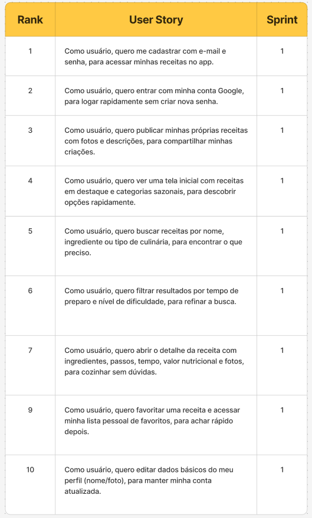
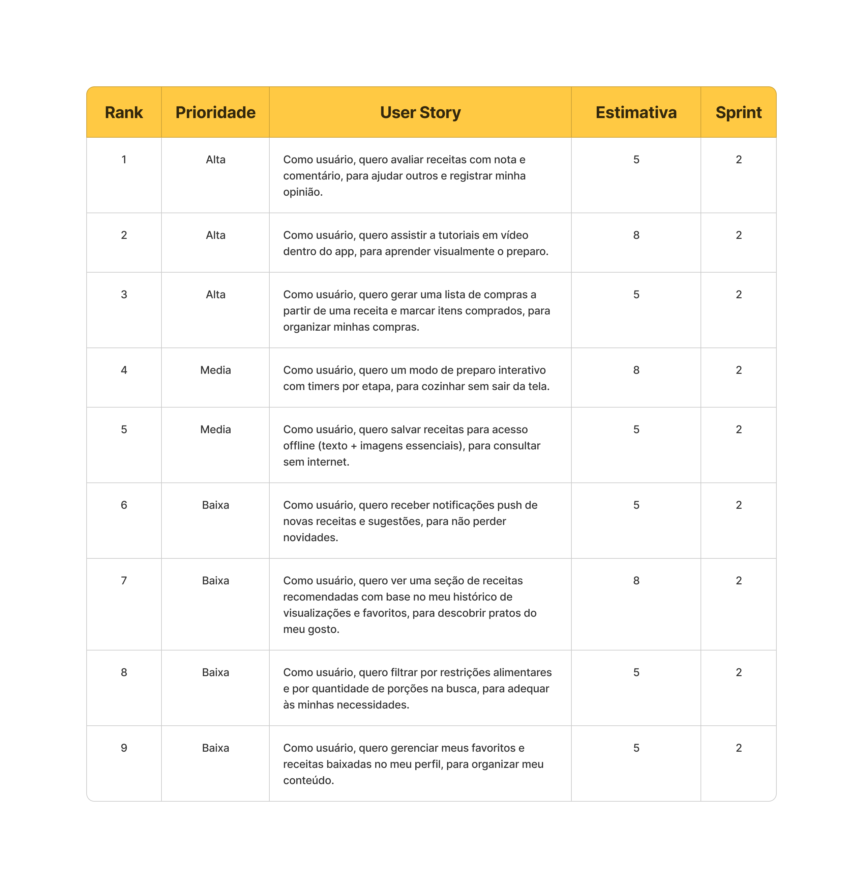
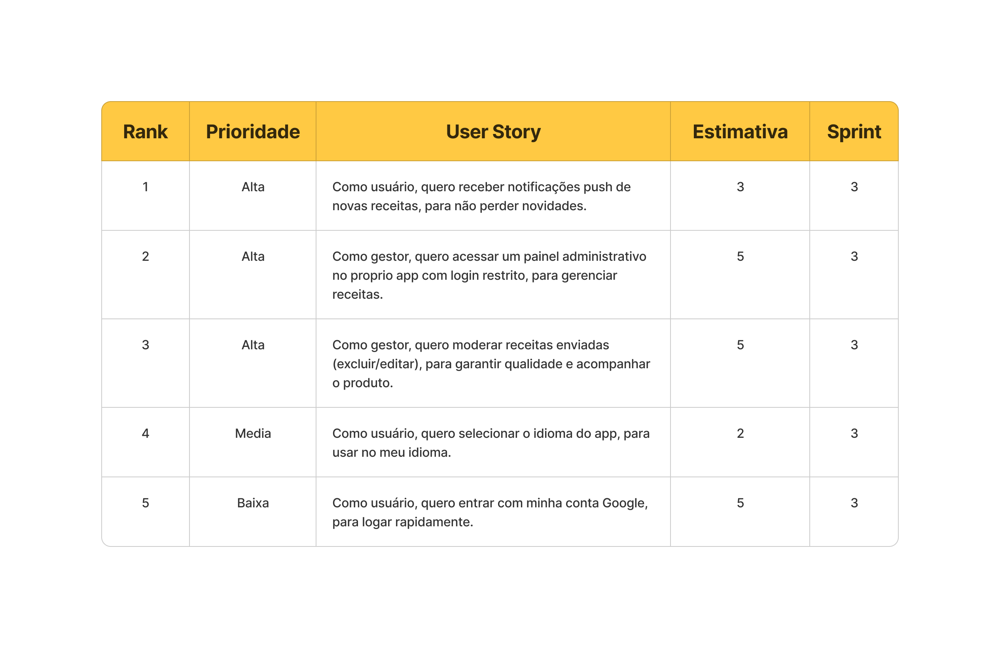

# Cookiefy 🍳

## 🖥️ Descrição

O Cookiefy é uma plataforma inovadora para compartilhamento e descoberta de receitas culinárias. Nosso objetivo é conectar amantes da culinária através de uma experiência intuitiva e funcional para explorar, criar e compartilhar receitas deliciosas.

---

## 📖 Backlog do Produto

[Backlog do Produto](./documentation/images/user-stories.png)

---

## 📅 Sprints

**Sprint 1**: [User Stories](./documentation/images/user-stories-sprint-1.png)

**Sprint 2**: 🚧 [Futuro Desenvolvimento](./docs/backlog.md#sprint-2---funcionalidades-avançadas-em-desenvolvimento-)

**Sprint 3**: 🚧 [Futuro Desenvolvimento](./docs/backlog.md#sprint-3---recursos-premium-planejado-)

---

### Sprint 1

1. **Alta**: Como usuário, quero me cadastrar com e-mail e senha, para acessar minhas receitas no app. (5)
2. **Alta**: Como usuário, quero publicar minhas próprias receitas com fotos e descrições, para compartilhar minhas criações. (8)
3. **Alta**: Como usuário, quero ver uma tela inicial com receitas em destaque e categorias, para descobrir opções rapidamente. (8)
4. **Média**: Como usuário, quero buscar receitas por nome, ingrediente ou tipo de culinária, para encontrar o que preciso. (2)
5. **Média**: Como usuário, quero filtrar resultados por tempo de preparo e nível de dificuldade, para refinar a busca. (5)
6. **Média**: Como usuário, quero abrir o detalhe da receita com ingredientes, passos, tempo, valor nutricional e fotos, para cozinhar sem dúvidas. (5)
7. **Baixa**: Como usuário, quero um modo de preparo interativo com timers por etapa, para cozinhar sem sair da tela. (5)
8. **Baixa**: Como usuário, quero favoritar uma receita e acessar minha lista pessoal de favoritos, para achar rápido depois. (5)
9. **Baixa**: Como usuário, quero editar dados básicos do meu perfil (nome/foto), para manter minha conta atualizada. (2)



### Sprint 2

1. **Alta**: Como usuário, quero entrar com minha conta Google, para logar rapidamente. (5)
2. **Alta**: Como usuário, quero avaliar receitas com nota e comentário, para ajudar outros e registrar minha opinião. (5)
3. **Alta**: Como usuário, quero gerar uma lista de compras a partir de uma receita e marcar itens comprados, para organizar minhas compras. (5)
4. **Média**: Como usuário, quero salvar receitas para acesso offline (texto + imagens essenciais), para consultar sem internet. (3)
5. **Baixa**: Como usuário, quero receber notificações push de novas receitas e sugestões, para não perder novidades. (3)
6. **Baixa**: Como usuário, quero compartilhar uma receita via WhatsApp/Instagram/Facebook, para dividir com amigos e família. (3)



### Sprint 3

1. **Alta**: Como gestor, quero acessar um painel administrativo no próprio app com login restrito, para gerenciar receitas. (5)
2. **Alta**: Como gestor, quero moderar receitas enviadas (excluir/editar) e monitorar estatísticas de uso, para garantir qualidade e acompanhar o produto. (5)
3. **Média**: Como usuário, quero usar comandos de voz para buscar e navegar pelos passos da receita, para cozinhar com as mãos livres. (8)
4. **Média**: Como usuário, quero selecionar o idioma do app e ver conteúdos traduzidos quando disponíveis, para usar no meu idioma. (2)



---

## 🚀 Instalação

O Cookiefy é composto por dois projetos principais:

- [cookiefy-mobile](https://github.com/0thigs/cookiefy-mobile): Aplicativo mobile (React Native + Expo)

- [cookiefy-server](https://github.com/0thigs/cookiefy-server): API/Servidor (Node.js + TypeScript + Prisma)

Siga os passos abaixo para rodar ambos localmente:

### 1. Clonar os repositórios

```bash
git clone https://github.com/0thigs/cookiefy-mobile.git

git clone https://github.com/0thigs/cookiefy-server.git
```

---

### 2. Instalar dependências

#### Mobile (App)

```bash
cd cookiefy-mobile
npm install
```

#### Servidor (API)

```bash
cd ../cookiefy-server
npm install
```

---

### 3. Configurar variáveis de ambiente

#### Mobile

- Edite o arquivo `app.json` e configure o campo `extra.apiBaseUrl` para apontar para a URL da API local, por exemplo:
  ```json
  "extra": {
    "apiBaseUrl": "http://localhost:3333"
  }
  ```

#### Servidor

- Copie `.env.example` para `.env` e preencha as variáveis:
  ```bash
  cp .env.example .env
  ```
- Configure as variáveis principais, como:
  - `DATABASE_URL` (string de conexão do PostgreSQL)
  - `JWT_ACCESS_SECRET` e `JWT_REFRESH_SECRET` (chaves secretas)

---

### 4. Configurar o banco de dados (Servidor)

Certifique-se de ter o PostgreSQL rodando e a string de conexão correta no `.env`.

```bash
# Executar as migrations do Prisma
npx prisma migrate

```

---

### 5. Rodar os projetos

#### Servidor (API)

```bash
cd cookiefy-server
npm run dev
```

A API estará disponível em http://localhost:3333

#### Mobile (App)

Abra um novo terminal:

```bash
cd cookiefy-mobile
npx expo start
```

O Expo abrirá o app no navegador e você poderá rodar no emulador ou dispositivo físico.

---

### 6. Testar a aplicação

- Acesse a API em [http://localhost:3333/docs](http://localhost:3333/docs) para ver a documentação Swagger.
- Use o app mobile normalmente, ele já estará conectado à API local.

---

### Observações

- Para rodar em produção, consulte os READMEs de cada repositório para detalhes de build e deploy.
- Certifique-se de que as portas não estejam em uso e que o mobile aponte para o IP correto da API se for testar em dispositivo físico.

8. **Baixa**: Como usuário, quero favoritar uma receita e acessar minha lista pessoal de favoritos, para achar rápido depois. (5)
9. **Baixa**: Como usuário, quero editar dados básicos do meu perfil (nome/foto), para manter minha conta atualizada. (2)

---

<!-- ## 📚 Documentação

- [Documentação do Projeto](./docs/README.md)
- [Backlog do Produto](./docs/backlog.md)
- [Arquitetura do Sistema](./docs/architecture.md)
- [API Documentation](./docs/api.md)
- [Padrão de Commits](./docs/commit-guideline.md) -->

---

## 📜 Licença

Este projeto está licenciado sob a Licença MIT. Para mais detalhes, consulte o arquivo [LICENSE](LICENSE).

---

## 👨‍💻 Autor

### 0thigs
