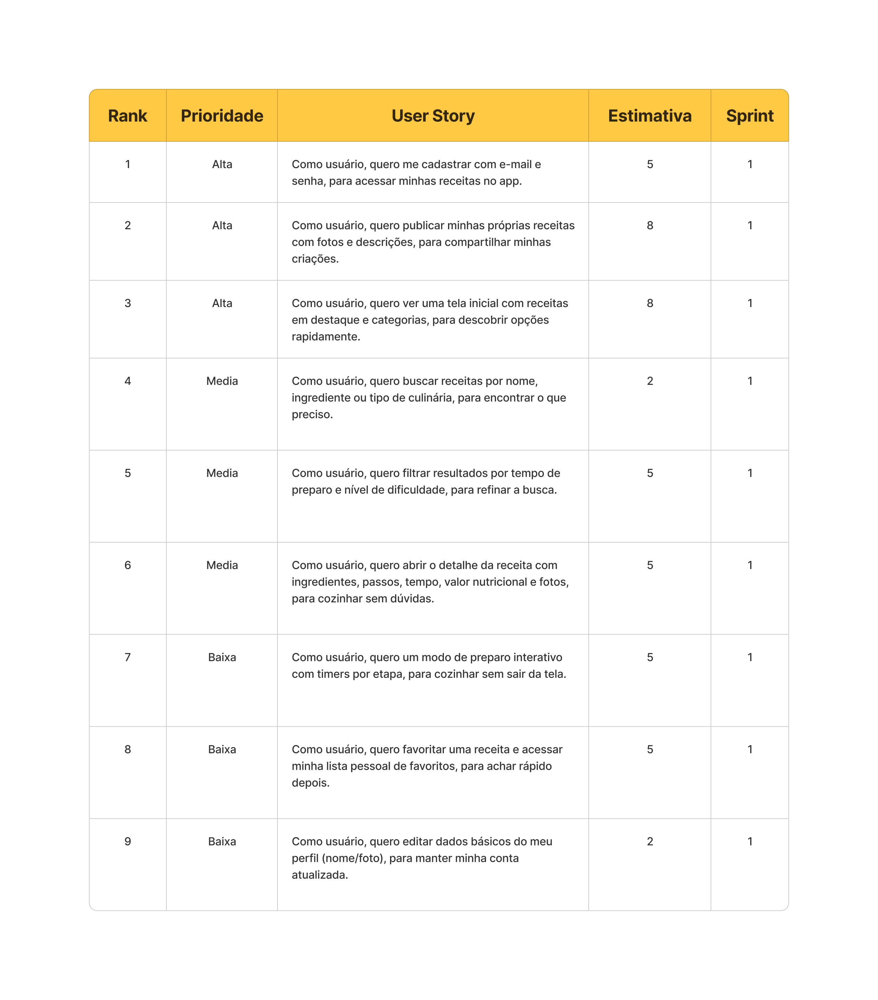
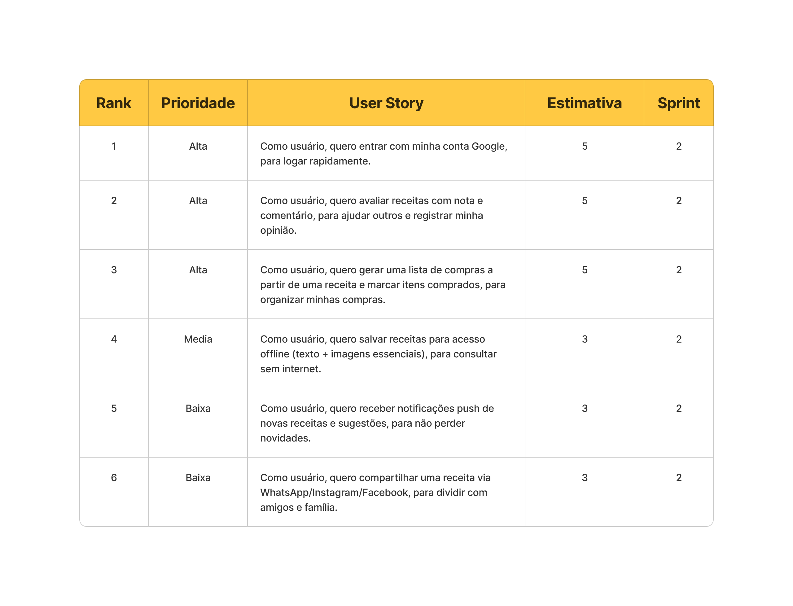

# Recipe Flow 🍳

## 🖥️ Descrição

O Recipe Flow é uma plataforma inovadora para compartilhamento e descoberta de receitas culinárias. Nosso objetivo é conectar amantes da culinária através de uma experiência intuitiva e funcional para explorar, criar e compartilhar receitas deliciosas.

---

## 📖 Backlog do Produto

🚧 Em andamento 🚧

---

## 📅 Sprints

**Sprint 1**: ✅ [Concluído](./docs/backlog.md#sprint-1---mvp-concluído-)
**Sprint 2**: 🚧 [Em Desenvolvimento](./docs/backlog.md#sprint-2---funcionalidades-avançadas-em-desenvolvimento-)
**Sprint 3**: 📋 [Planejado](./docs/backlog.md#sprint-3---recursos-premium-planejado-)

---

## 🛠️ Tecnologias

### 📱 Mobile
- [React Native](https://reactnative.dev/) para construir a interface do aplicativo
- [TypeScript](https://www.typescriptlang.org/) para garantir a tipagem estrita e a robustez do código
- [Expo](https://expo.dev/) para facilitar o desenvolvimento e a distribuição do aplicativo
- [NativeBase](https://nativebase.io/) para criar componentes de interface consistentes e estilizados

### 📟 Servidor
- [Node.js](https://nodejs.org/) com [Express](https://expressjs.com/) para construir o servidor
- [TypeScript](https://www.typescriptlang.org/) para garantir a tipagem estrita e a robustez do código
- [Prisma](https://www.prisma.io/) para gerenciar o banco de dados

### 📦 Banco de Dados
- [PostgreSQL](https://www.postgresql.org/) para o banco de dados
- [Supabase](https://supabase.com/) para autenticação e armazenamento

---

## 🌐 Estrutura do Projeto

🚧 Em andamento 🚧

---

## 📋 Funcionalidades por Sprint

### Sprint 1
* Cadastro por e‑mail/senha
* Login com Google
* Publicação de receitas próprias (fotos + descrição)
* Tela inicial com destaques e categorias sazonais
* Busca por nome, ingrediente e tipo de culinária
* Filtros por tempo de preparo e nível de dificuldade
* Detalhe da receita (ingredientes, passos, tempo, valor nutricional, fotos)
* Favoritar receita e lista pessoal de favoritos
* Edição de perfil (nome e foto)



### Sprint 2
* Avaliar receitas com nota e comentário
* Tutoriais em vídeo dentro do app
* Gerar lista de compras a partir da receita e marcar itens comprados
* Modo de preparo interativo com timers por etapa
* Salvar receitas para acesso **offline** (texto + imagens essenciais)
* Notificações push de novas receitas e sugestões
* Recomendações com base em histórico de visualizações e favoritos
* Filtros por restrições alimentares e por quantidade de porções
* Gerenciar favoritos e receitas baixadas no perfil



### Sprint 3
* Painel administrativo no app (login restrito) para gestão de receitas
* Moderação de receitas enviadas (excluir/editar) e métricas básicas
* Comandos de voz para buscar e navegar pelos passos da receita
* Seleção de idioma do app e conteúdos traduzidos quando disponíveis
* Compartilhar receita (WhatsApp/Instagram/Facebook)
* Ajuste de porções com recálculo automático de ingredientes


---

## 🚀 Instalação

Para configurar e executar o projeto localmente, siga estas etapas:

### Pré-requisitos
Certifique-se de ter instalado:
- Node.js
- Yarn ou npm
- PostgreSQL
- Expo CLI

### Passos
1. Clone o repositório:
```bash
git clone https://github.com/0thigs/recipe-flow.git
```

2. Instale as dependências:
```bash
cd recipe-flow
yarn install
```

3. Configure as variáveis de ambiente conforme o arquivo `.env.example`.

4. Execute o servidor de desenvolvimento:
```bash

```

5. Acesse o aplicativo no navegador: [http://localhost:3000](http://localhost:3000).

---

## 📚 Documentação

- [Documentação do Projeto](./docs/README.md)
- [Backlog do Produto](./docs/backlog.md)
- [Arquitetura do Sistema](./docs/architecture.md)
- [API Documentation](./docs/api.md)
- [Padrão de Commits](./docs/commit-guideline.md)

---

## 📜 Licença

Este projeto está licenciado sob a Licença MIT. Para mais detalhes, consulte o arquivo [LICENSE](LICENSE).

---

## 👨‍💻 Autor

### [Seu Nome]
> Desenvolvedor de Software e entusiasta da culinária
